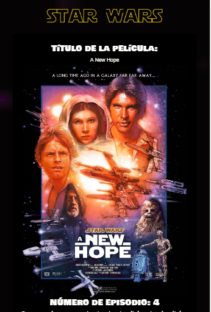

# Swapi

Swapi es la Api de Star Wars que te proporciona data sobre los planetas, naves espaciales, vehículos, personas, películas y especies propios de las películas.

En este proyecto por medio de una petición fetch se accede a las 7 peliculas con sus personajes. Con una segunda petición se obtiene la información  de los personajes considerando: height, hair color, mass y skin color.

## Herramientas utilizadas:

- JavaScript
- Api
- Peticiones con fetch
- Responsive web desing

### Proyecto desarrollado para: 

Laboratoria

```
Vista previa
```



```
Modal con información del personaje
```


